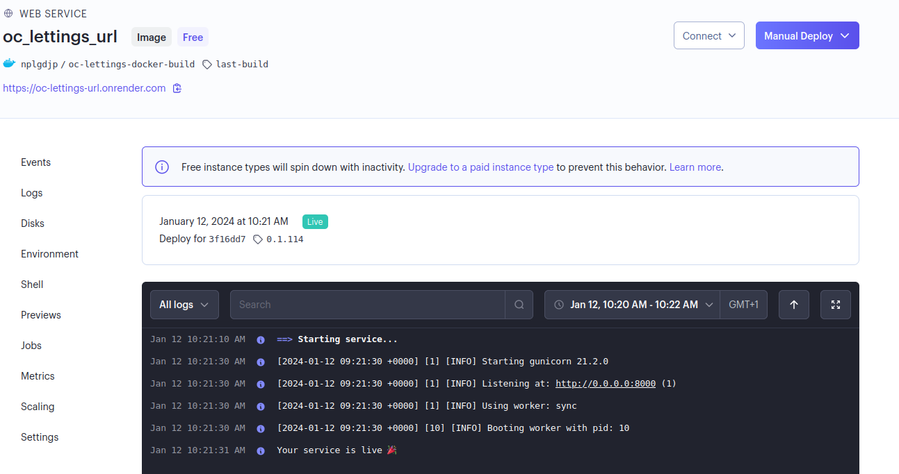

<p align = center>

</p>

# OC Lettings

<p align = center>Mettre à l'échelle une application Django, en utilisant une architecture modulaire.

Basé sur un projet à forker : 
- https://github.com/OpenClassrooms-Student-Center/Python-OC-Lettings-FR

Il s'appuie sur Python3.11 et :</p>

<p align = center>
    <a href="https://docs.djangoproject.com/fr/3.2/">    
        
    </a>
    <a href="https://www.docker.com/">
        
    </a>
    <a href="https://circleci.com/">     
      
    </a>
    <a href="https://sentry.io/welcome/">
        
    </a>
    <a href="https://www.sphinx-doc.org/en/master/#">
        
    </a>
    <a href="https://docs.readthedocs.io/en/stable/#">
        
    </a>
</p>

## But du project : 
*Aborder au travers des bonnes pratiques DevOps, la phase de mise en production d'un projet:*
- Réduire une dette technique grace à :  
    - la refonte de l'architecture du projet.
    - la résolution de bug.
    - la mise en place d'une politique de tests.
    - le monitoring de certaines données avec Sentry.
- Containerisation du projet avec Docker.
- Automatisation des phases de tests, de contrôle qualité et de déployement, avec Circle Ci et Render.
- Automatisation et déploiement de documentation avec Sphinx et Read the Docs.


# Pré-requis : 

- Un compte DockerHub
- Un compte Sentry
- Un compte Circle Ci
- Un compte Render
- Un compte Read The Doc


# Installation du project:

## Cloner le projet:
```bash
    git clone https://github.com/LGD-P/P13_Open_C.git
```
## Installer le gestionnaire de dépendances poetry:
    
    pip3 install poetry 

## Activer l'environnement virtuel depuis P13_Open_C/:

    poetry shell 

## Installer les dépendances:

    poetry install 
    poetry update

## Créer et pousser l'image sur son Docker Hub    :

```bash
docker login -u votre-identifiant
docker build -t oc-lettings-docker-build .
docker tag oc-lettings-docker-build:latest votre-identifiant/oc-lettings-build:last-build
docker push votre-identifiant/oc-lettings-build:latest
```


## Les variables d’environnement :

Ce projet utilise dotenv et il vous faut adapter un certain nombre de variables d’environnement sur les différentes plateformes utilisées.

- Directement pour le projet Django dans .env

```bash
SENTRY_DNS ="à récupérer sur Sentry"
SECRET_KEY="à générer pour le fonctionnement de Django"
```


Le site est désormais accéssible sur  : ==> https://oc-lettings-url.onrender.com

Et la documentation sur  : ==> https://p13-open-c.readthedocs.io/fr/latest/

*pour plus d'information consulter la documentation*


## Fonctionnement de la pipeline :
<details> 
  <summary> Workflow : </summary>

  Le déploiement de l'application suit le workflow de la piplice Circle Ci. Il est prévu pour 
  s'éxécuter sur la branche master. 

  ```yaml

      workflows:
          build-and-test:
              jobs:
              - coverage
              - flake8
              - build-publish:
                  requires:
                      - coverage
                      - flake8
                  filters:
                      branches:
                      only: master 
  ```
</details>


<details>
  <summary> Version et Obrs : </summary>

  ```yaml

    version: 2.1

    orbs:
      python: circleci/python@2
  ```

  - La pipeline CircleCI décrite ci-dessus est configurée selon la version 2.1 de CircleCI.
  - Elle utilise l'orbe python@2 pour faciliter l'exécution de tâches liées à Python.

</details>

<details>
  <summary> Build and test: </summary>

  ```yaml
    jobs:
      coverage:
        # Install dependencies and run tests
        docker:
          - image: cimg/python:3.11.6
        steps:
          - checkout
          - python/install-packages: 
            pkg-manager: poetry

          - run:
              name: Run tests 
              command: poetry run pytest -v --cov=. > cov-report.txt

          - run:
              name: Check coverage # circleci step halt stop build if failed
              command: |
                cov_result=$(grep -w 'TOTAL' cov-report.txt | awk '{print $NF}' | tr -d '%')
                if [ "$cov_result" -gt 80 ]; then
                  echo 'Tests cover more than 80% of your project'
                else
                  echo 'Fail: Tests cover less than 80% of your project'
                  circleci step halt
                fi 
  ```

  - La pipeline comprend deux jobs : "coverage" et "flake8".

  Le job "coverage" utilise une image Docker basée sur Python 3.11.6 pour installer les dépendances 
  et exécuter les tests. Les étapes de ce job sont les suivantes :

  - **checkout** : récupère le code source du projet depuis le référentiel.

  - **python/install-packages** : installe les packages nécessaires à l'aide de Poetry,gestionnaire de
    dépendances pour Python.

  - **run (Run tests)** : exécute les tests en utilisant la commande "poetry run pytest -v --cov=. > cov-report.txt".
    Cela lance les tests et génère un rapport de couverture.
  
  - **run (Check coverage)** : vérifie la couverture de test en utilisant le rapport de couverture généré précédemment
    Si la couverture est supérieure à 80%, un message "Tests cover more than 80% of your project" est affiché. 
    Sinon, un message "Fail: Tests cover less than 80% of your project" est affiché et le build est arrêté avec 
    la commande "circleci step halt".


  ```yaml

      flake8:
        # Install dependencies and run tests
        docker:
          - image: cimg/python:3.11.6
        steps:
          - checkout
          - python/install-packages: 
            pkg-manager: poetry

          - run: 
              name: flake8 
              command: poetry run flake8
  ```

  - Le job "**flake8**" est similaire au job "coverage". 
  - Il utilise également l'image Docker Python 3.11.6, installe les dépendances avec Poetry,
    puis exécute la commande "poetry run flake8" pour vérifier les erreurs de conformité aux règles de codage. 

</details>

<details>
  <summary> Build and publish: </summary>


  **Si** et uniquement **si** la partie précédente a été validée la pipeline suit les étapes suivantes : 

  ```yaml

    build-publish:
      docker:
        - image: cimg/base:2023.12
      steps:
        - checkout
        - setup_remote_docker
        - run: 
            name: login build and push
            command: |
              TAG=0.1.$CIRCLE_BUILD_NUM
              echo "export TAG=$TAG" >> $BASH_ENV
              docker build -t $DOCKER_USER/oc-lettings-docker-build:$TAG .
              echo $DOCKER_TOKEN | docker login -u $DOCKER_USER --password-stdin
              docker push $DOCKER_USER/oc-lettings-docker-build:$TAG
        - run:
            name: Trigger Render deploy
            command: |
              source $BASH_ENV
              curl "$DEPLOY_HOOK&imgURL=docker.io%2F$DOCKER_USER%2Foc-lettings-docker-build%3A$TAG"
  ```

  **build-publish** utilise l'image Docker "cimg/base:2023.12" pour créer et publier une image Docker 
  pour le projet "oc-lettings-docker-build"

  - **checkout** : récupère le code source du projet depuis le référentiel.
  - **setup_remote_docker** : configure l'accès distant au serveur Docker pour permettre la création et la publication 
    de l'image.
  - **run (login build and push)** : cette étape effectue les actions suivantes :

    - Définit la variable **TAG** en utilisant le numéro unique de build de CircleCI.
    - Exporte cette variable dans le BASH_ENV afin qu'elle puisse être ré-utilisée
    - Construit l'image Docker en utilisant la commande 
      "**docker build -t $DOCKER_USER/oc-lettings-docker-build:$TAG .**".
    - Effectue la connexion au registre Docker en utilisant le nom d'utilisateur **$DOCKER_USER** et le jeton 
      **$DOCKER_TOKEN** pour l'authentification.
    - Pousse l'image Docker vers le registre en utilisant la commande 
      **"docker push $DOCKER_USER/oc-lettings-docker-build:$TAG".**

  - **run (Trigger Render deploy)** : 

    - cette étape déclenche un déploiement en appelant une URL de déclenchement (**$DEPLOY_HOOK**) 
      avec l'URL de l'image Docker précédemment publiée.

</details>

<details>
  <summary> Deploiement: </summary>

  **L'application est désormais déployée et accessible sur ==>** https://oc-lettings-url.onrender.com


  <p align = center>
  
  </p>
  </details>


