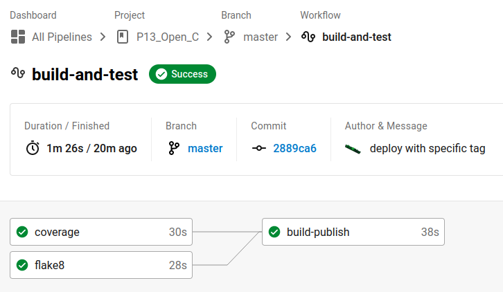
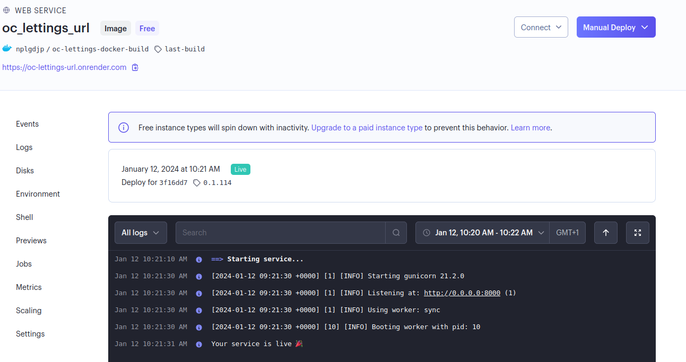
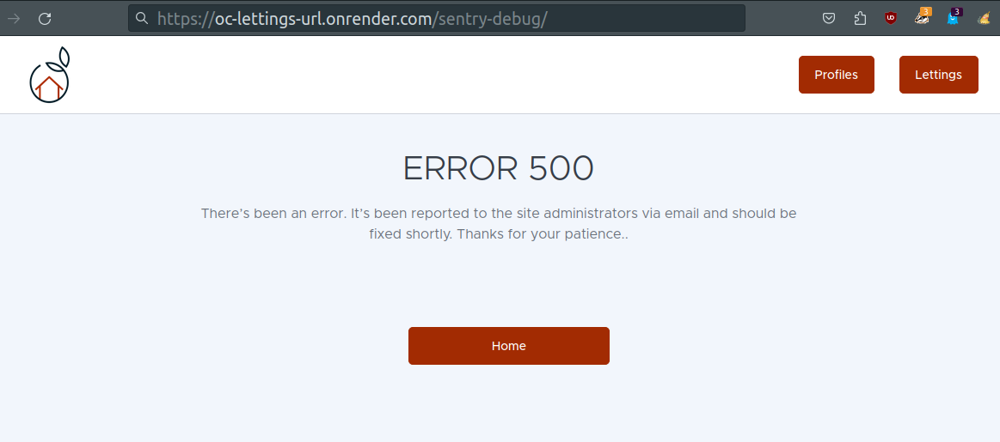
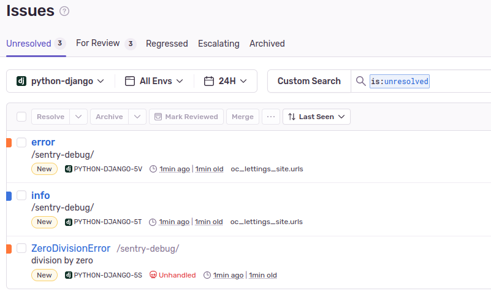

.. _deployment_process:

=========================================
Déploiement et Gestion de l'application :
=========================================

Le déploiement de l'application suit le workflow de la piplice Circle Ci. Il est prévu pour 
s'éxécuter sur la branche master. 

.. code-block:: yaml

    workflows:
        build-and-test:
            jobs:
            - coverage
            - flake8
            - build-publish:
                requires:
                    - coverage
                    - flake8
                filters:
                    branches:
                    only: master 

===================================

Explication par étape de la pipline : 
-------------------------------------

.. code-block:: yaml

  version: 2.1

  orbs:
    python: circleci/python@2

- La pipeline CircleCI décrite ci-dessus est configurée selon la version 2.1 de CircleCI.
- Elle utilise l'orbe python@2 pour faciliter l'exécution de tâches liées à Python.

===================================

**Build and test :** 
--------------------

.. code-block:: yaml

  jobs:
    coverage:
      # Install dependencies and run tests
      docker:
        - image: cimg/python:3.11.6
      steps:
        - checkout
        - python/install-packages: 
          pkg-manager: poetry

        - run:
            name: Run tests 
            command: poetry run pytest -v --cov=. > cov-report.txt

        - run:
            name: Check coverage # circleci step halt stop build if failed
            command: |
              cov_result=$(grep -w 'TOTAL' cov-report.txt | awk '{print $NF}' | tr -d '%')
              if [ "$cov_result" -gt 80 ]; then
                echo 'Tests cover more than 80% of your project'
              else
                echo 'Fail: Tests cover less than 80% of your project'
                circleci step halt
              fi 

- La pipeline comprend deux jobs : "coverage" et "flake8".

Le job "coverage" utilise une image Docker basée sur Python 3.11.6 pour installer les dépendances 
et exécuter les tests. Les étapes de ce job sont les suivantes :

  - **checkout** : récupère le code source du projet depuis le référentiel.

  - **python/install-packages** : installe les packages nécessaires à l'aide de Poetry,gestionnaire de
    dépendances pour Python.

  - **run (Run tests)** : exécute les tests en utilisant la commande "poetry run pytest -v --cov=. > cov-report.txt".
    Cela lance les tests et génère un rapport de couverture.
  
  - **run (Check coverage)** : vérifie la couverture de test en utilisant le rapport de couverture généré précédemment
    Si la couverture est supérieure à 80%, un message "Tests cover more than 80% of your project" est affiché. 
    Sinon, un message "Fail: Tests cover less than 80% of your project" est affiché et le build est arrêté avec 
    la commande "circleci step halt".

===================================

.. code-block:: yaml

    flake8:
      # Install dependencies and run tests
      docker:
        - image: cimg/python:3.11.6
      steps:
        - checkout
        - python/install-packages: 
          pkg-manager: poetry

        - run: 
            name: flake8 
            command: poetry run flake8

- Le job "**flake8**" est similaire au job "coverage". 
- Il utilise également l'image Docker Python 3.11.6, installe les dépendances avec Poetry,
  puis exécute la commande "poetry run flake8" pour vérifier les erreurs de conformité aux règles de codage. 

===================================

**Build and publish :** 
-----------------------

**Si** et uniquement **si** la partie précédente a été validée la pipeline suit les étapes suivantes : 

.. code-block:: yaml

  build-publish:
    docker:
      - image: cimg/base:2023.12
    steps:
      - checkout
      - setup_remote_docker
      - run: 
          name: login build and push
          command: |
            TAG=0.1.$CIRCLE_BUILD_NUM
            echo "export TAG=$TAG" >> $BASH_ENV
            docker build -t $DOCKER_USER/oc-lettings-docker-build:$TAG .
            echo $DOCKER_TOKEN | docker login -u $DOCKER_USER --password-stdin
            docker push $DOCKER_USER/oc-lettings-docker-build:$TAG
      - run:
          name: Trigger Render deploy
          command: |
            source $BASH_ENV
            curl "$DEPLOY_HOOK&imgURL=docker.io%2F$DOCKER_USER%2Foc-lettings-docker-build%3A$TAG"

**build-publish** utilise l'image Docker "cimg/base:2023.12" pour créer et publier une image Docker 
pour le projet "oc-lettings-docker-build"

- **checkout** : récupère le code source du projet depuis le référentiel.
- **setup_remote_docker** : configure l'accès distant au serveur Docker pour permettre la création et la publication 
  de l'image.
- **run (login build and push)** : cette étape effectue les actions suivantes :

  - Définit la variable **TAG** en utilisant le numéro unique de build de CircleCI.
  - Exporte cette variable dans le BASH_ENV afin qu'elle puisse être ré-utilisée
  - Construit l'image Docker en utilisant la commande 
    "**docker build -t $DOCKER_USER/oc-lettings-docker-build:$TAG .**".
  - Effectue la connexion au registre Docker en utilisant le nom d'utilisateur **$DOCKER_USER** et le jeton 
    **$DOCKER_TOKEN** pour l'authentification.
  - Pousse l'image Docker vers le registre en utilisant la commande 
    **"docker push $DOCKER_USER/oc-lettings-docker-build:$TAG".**

- **run (Trigger Render deploy)** : 

  - cette étape déclenche un déploiement en appelant une URL de déclenchement (**$DEPLOY_HOOK**) 
    avec l'URL de l'image Docker précédemment publiée.

===================================

L'application est désormais déployée et accessible sur ==> https://oc-lettings-url.onrender.com

===================================

Monitoring de l'application avec Sentry :   
-----------------------------------------

.. code-block:: python

  logging.basicConfig(level=logging.INFO)

  sentry_sdk.init(
      dsn=os.getenv('SENTRY_DNS'),
      enable_tracing=True,
      integrations=[
          LoggingIntegration(
              level=logging.INFO,  
              event_level=logging.INFO  
          ),

          DjangoIntegration(
              transaction_style='url',
              middleware_spans=True,
              signals_spans=True,
              cache_spans=True,
          ),

      ],
      profiles_sample_rate=1.0,
  )

Le code ci-dessus est implémenté dans le settings.py d'oc_lettings_site, il configure un 
système de journalisation (logging) avec Sentry

- **logging.basicConfig(level=logging.INFO)** : définit le niveau de journalisation à INFO.

- **sentry_sdk.init()** : C'est l'initialisation de l'intégration Sentry de l'application. 
   - **dsn** : Il s'agit de l'URL Sentry où les erreurs seront envoyées. 
   
    - **enable_tracing** : permet la capture des traces de performance de l'application. 
   
   - **integrations** : liste d'intégrations configurées pour Sentry.

    - **LoggingIntegration** : Permet de capturer les enregistrements de journalisation (logging) 
      au niveau INFO.

    - **DjangoIntegration** : Cette intégration configure les fonctionnalités spécifiques de Django telles
      que la capture des transactions via les URL, la capture des traces des middlewares, des signaux et des caches.

- **profiles_sample_rate=1.0** : Cela définit le taux d'échantillonnage de profilage de Sentry à 100%. 
  Cela signifie que toutes les erreurs et traces seront envoyées à Sentry.

===================================

*En résumé, le système de journalisation au niveau INFO et active l'intégration de Sentry dans l'application Django 
oc_lettings_site.*

*L'intégration de Sentry permet de capturer et de suivre les erreurs et les performances de l'application, 
fournissant ainsi des informations précieuses pour le débogage et l'optimisation de l'application.*

===================================

Cas d'usage : 
-------------

.. code-block:: python

  from django.contrib import admin
  from django.urls import path, include
  import logging

  from . import views

  logger = logging.getLogger(__name__)

  def trigger_error(request):
      logger.info('info')
      logger.error('error')
      division_by_zero = 1 / 0
      return division_by_zero

  urlpatterns = [
      path('', views.index, name='index'),
      path('lettings/', include('lettings.urls')),
      path('profiles/', include('profiles.urls')),
      path('admin/', admin.site.urls),
      path('sentry-debug/', trigger_error, name='sentry'),
      ]

===========================

Tentative d'accès à : https://oc-lettings-url.onrender.com/sentry-debug/

============================

Remontée d'erreur dans Sentry : 

