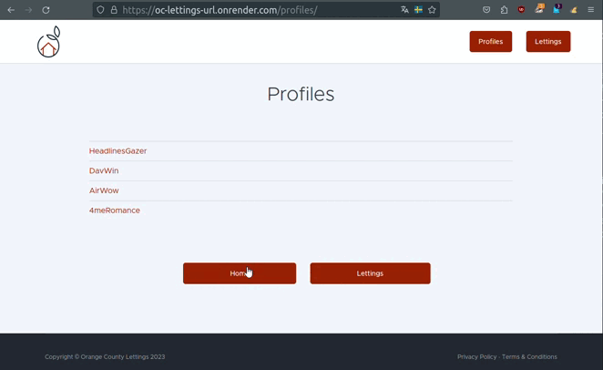

.. _user_guide:

===================
Guide utilisateur :
===================

OC-LETTINGS-SITE est une application Django pour la gestion d'adresses
de locations et de profils utilisateurs. Une fois déployée elle est accéssible depuis : 

- https://oc-lettings-url.onrender.com/

Page Principale : index
-----------------------

Cette page donne accès à deux boutons Lettings et Profiles

Lettings : 
----------

- L'onglet "Lettings" vous permet de visualiser une liste de locations disponibles.
- Vous pouvez voir le titre de chaque location ainsi que son adresse associée. 
- Vous pouvez cliquer sur une location pour voir plus de détails.

Profiles : 
----------

- L'onglet "Profiles" vous permet de voir la liste des profils d'utilisateurs. 
- Chaque profil affiche le nom de l'utilisateur et sa ville préférée. 
- Vous pouvez cliquer sur un profil pour afficher plus d'informations.

*L'onglet back permet de revenir à la page précédentes et home à la page principale*

L'interface administrateur : 
----------------------------

Une interface administrateur est accessible au super utilisateur via l'uri /admin

.. code-block:: python

    poetry run python3 manage.py createsuperuser

- Username : Votre super utilisateur
- Password : Votre password

Cas d'erreurs : 
---------------

- Une gestion des erreurs 404 et 500 est implémentée pour rediriger l'utilisateur vers un message classique d'erreur. 
